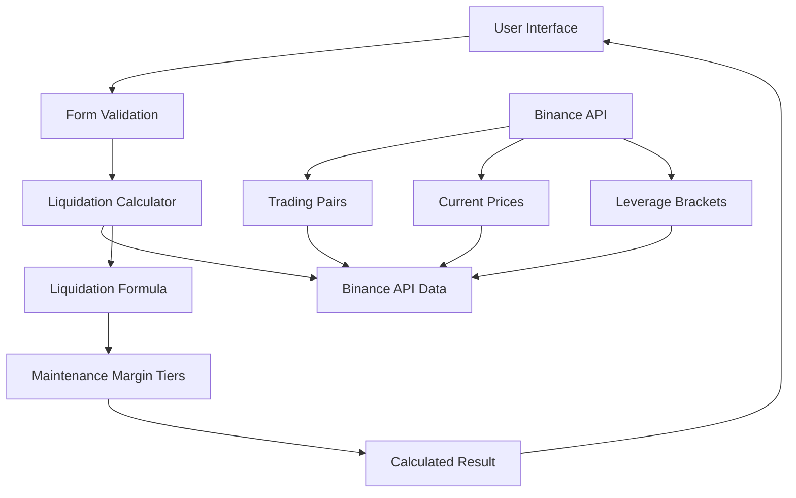

# เอกสารการออกแบบ

## ภาพรวม

Binance Futures Calculator เป็นเว็บแอปพลิเคชันที่ออกแบบมาเพื่อคำนวณราคา liquidation สำหรับ USDⓈ-M perpetual futures contracts ของ Binance อย่างแม่นยำ โดยใช้สูตรและข้อมูลอย่างเป็นทางการจาก Binance API แอปพลิเคชันจะมีการออกแบบที่คล้ายกับ Binance โดยใช้ Next.js 15 และ TypeScript

## สถาปัตยกรรม

### Frontend Architecture
```
┌─────────────────────────────────────────────────────────────┐
│                    Next.js 15 App Router                   │
├─────────────────────────────────────────────────────────────┤
│  Components Layer                                           │
│  ├── FuturesCalculator (Main Component)                     │
│  ├── LiquidationCalculator (Core Logic)                     │
│  ├── TradingPairSelector (Dropdown)                         │
│  └── UI Components (shadcn/ui)                              │
├─────────────────────────────────────────────────────────────┤
│  Business Logic Layer                                       │
│  ├── liquidation-formula.ts (Core Calculations)             │
│  ├── binance-api.ts (API Integration)                       │
│  └── validation.ts (Form Validation)                        │
├─────────────────────────────────────────────────────────────┤
│  API Layer                                                  │
│  ├── /api/binance/symbols (Trading Pairs)                   │
│  ├── /api/binance/ticker (Current Prices)                   │
│  └── /api/binance/leverage-brackets (Margin Data)           │
└─────────────────────────────────────────────────────────────┘
```

### Data Flow Architecture


## คอมโพเนนต์และอินเทอร์เฟซ

### 1. หลักคอมโพเนนต์

#### FuturesCalculator Component
```typescript
interface FuturesCalculatorProps {
  initialSymbol?: string;
}

interface CalculatorState {
  selectedSymbol: string;
  position: 'LONG' | 'SHORT';
  marginMode: 'CROSS' | 'ISOLATED';
  leverage: number;
  entryPrice: number;
  quantity: number;
  balance: number;
  currentPrice: number;
}
```

#### TradingPairSelector Component
```typescript
interface TradingPair {
  symbol: string;
  baseAsset: string;
  quoteAsset: string;
  status: string;
  maintMarginPercent: string;
  requiredMarginPercent: string;
}

interface TradingPairSelectorProps {
  selectedSymbol: string;
  onSymbolChange: (symbol: string) => void;
  tradingPairs: TradingPair[];
  loading: boolean;
}
```

### 2. API Interfaces

#### Binance API Response Types
```typescript
interface BinanceSymbolInfo {
  symbol: string;
  status: string;
  baseAsset: string;
  quoteAsset: string;
  maintMarginPercent: string;
  requiredMarginPercent: string;
}

interface BinanceLeverageBracket {
  bracket: number;
  initialLeverage: number;
  notionalCap: number;
  notionalFloor: number;
  maintMarginRatio: number;
  cum: number;
}

interface BinanceTickerPrice {
  symbol: string;
  price: string;
}
```

## โมเดลข้อมูล

### 1. Maintenance Margin Tiers
```typescript
interface MaintenanceTier {
  minNotional: number;
  maxNotional: number;
  maintenanceMarginRate: number;
  maintenanceAmount: number;
  maxLeverage: number;
}
```

### 2. Liquidation Calculation Parameters
```typescript
interface LiquidationParams {
  position: 'LONG' | 'SHORT';
  marginMode: 'CROSS' | 'ISOLATED';
  entryPrice: number;
  quantity: number;
  leverage: number;
  balance: number;
  maintenanceTiers: MaintenanceTier[];
  unrealizedPnL?: number;
}

interface LiquidationResult {
  liquidationPrice: number;
  maintenanceMargin: number;
  maintenanceMarginRate: number;
  maxPositionSize: number;
  riskLevel: 'LOW' | 'MEDIUM' | 'HIGH';
}
```

## สูตรการคำนวณ Liquidation Price

### สูตรหลักของ Binance

#### สำหรับ Long Position (Cross Margin):
```
LP = (WB - TMM + UPNL + cum - Side × Position × EP) / (Position × (±1 - MMR))
```

#### สำหรับ Short Position (Cross Margin):
```
LP = (WB - TMM + UPNL + cum + Side × Position × EP) / (Position × (±1 - MMR))
```

#### สำหรับ Isolated Margin:
```
LP = (Position × EP ± Position × EP / Leverage - cum) / (Position × (±1 - MMR))
```

### ตัวแปรในสูตร:
- **WB**: Wallet Balance (ยอดคงเหลือในกระเป๋า)
- **TMM**: Total Maintenance Margin (ยอดรวม maintenance margin ของตำแหน่งอื่น)
- **UPNL**: Unrealized PnL ของตำแหน่งอื่น
- **cum**: Maintenance Amount จาก tier bracket
- **Side**: 1 สำหรับ Long, -1 สำหรับ Short
- **Position**: ขนาดตำแหน่ง (ค่าสัมบูรณ์)
- **EP**: Entry Price
- **MMR**: Maintenance Margin Rate จาก tier brackets

### Implementation Strategy
```typescript
function calculateLiquidationPrice(params: LiquidationParams): LiquidationResult {
  // 1. คำนวณ notional value
  const notionalValue = params.entryPrice * params.quantity;
  
  // 2. หา maintenance tier ที่เหมาะสม
  const tier = getMaintenanceTier(notionalValue, params.maintenanceTiers);
  
  // 3. คำนวณตามสูตร Binance
  if (params.marginMode === 'CROSS') {
    return calculateCrossMarginLiquidation(params, tier);
  } else {
    return calculateIsolatedMarginLiquidation(params, tier);
  }
}
```

## การจัดการข้อผิดพลาด

### 1. API Error Handling
```typescript
interface APIError {
  code: number;
  message: string;
  timestamp: number;
}

enum ErrorTypes {
  NETWORK_ERROR = 'NETWORK_ERROR',
  API_RATE_LIMIT = 'API_RATE_LIMIT',
  INVALID_SYMBOL = 'INVALID_SYMBOL',
  CALCULATION_ERROR = 'CALCULATION_ERROR'
}
```

### 2. Validation Errors
- ตรวจสอบค่าที่ป้อนเป็นตัวเลขบวก
- ตรวจสอบขนาดตำแหน่งไม่เกินขีดจำกัด
- ตรวจสอบ leverage ไม่เกินที่อนุญาต
- ตรวจสอบยอดคงเหลือเพียงพอ

### 3. Error Recovery Strategies
- Auto-retry สำหรับ network errors
- Fallback ไปใช้ข้อมูลที่ cache ไว้
- แสดงข้อความแนะนำให้ผู้ใช้

## กลยุทธ์การทดสอบ

### 1. Unit Tests
- ทดสอบสูตรการคำนวณ liquidation price
- ทดสอบการหา maintenance tier ที่ถูกต้อง
- ทดสอบ validation functions
- ทดสอบ API response parsing

### 2. Integration Tests
- ทดสอบการเรียก Binance API
- ทดสอบการอัปเดตข้อมูลแบบ real-time
- ทดสอบการทำงานของ form validation

### 3. E2E Tests
- ทดสอบ user flow ทั้งหมด
- ทดสอบการเปลี่ยนคู่เทรด
- ทดสอบการคำนวณในสถานการณ์ต่างๆ

### 4. Performance Tests
- ทดสอบความเร็วในการคำนวณ
- ทดสอบการโหลดข้อมูลจาก API
- ทดสอบ memory usage

## การรวม API

### 1. Binance REST API Endpoints

#### Get Exchange Information
```
GET /fapi/v1/exchangeInfo
```
- ดึงข้อมูลคู่เทรดทั้งหมด
- ข้อมูล minimum/maximum order sizes
- สถานะของแต่ละคู่เทรด

#### Get Symbol Price Ticker
```
GET /fapi/v1/ticker/price?symbol={symbol}
```
- ราคาปัจจุบันของคู่เทรด
- อัปเดตทุก 1 วินาที

#### Get Leverage Brackets
```
GET /fapi/v1/leverageBracket?symbol={symbol}
```
- Maintenance margin rates
- Leverage brackets
- Notional caps และ floors
- Maximum leverage สำหรับแต่ละ tier (ใช้สำหรับกำหนด max ของ slider)

### 2. Data Caching Strategy
```typescript
interface CacheConfig {
  exchangeInfo: { ttl: 3600000 }; // 1 hour
  leverageBrackets: { ttl: 3600000 }; // 1 hour  
  tickerPrices: { ttl: 30000 }; // 30 seconds
}
```

### 3. Rate Limiting
- ใช้ request queue เพื่อจำกัด API calls
- Implement exponential backoff
- Cache responses เพื่อลด API calls

## การออกแบบ UI/UX

### 1. Layout Structure (ใช้โค้ดเดิมที่มีอยู่)
การออกแบบจะใช้โครงสร้างเดิมของ `LiquidationCalculator` component ที่มีอยู่แล้ว โดยเพิ่มเฉพาะ Trading Pair Selector ที่ด้านบน:

```
┌─────────────────────────────────────────────────────────────┐
│  Trading Pair Selector (เพิ่มใหม่)                          │
│  ┌─────────────────────────────────────────────────────────┐ │
│  │ BTCUSDT Perp ▼                                          │ │
│  └─────────────────────────────────────────────────────────┘ │
├─────────────────────────────────────────────────────────────┤
│  [ใช้ Layout เดิมของ LiquidationCalculator]                │
│  - Margin Mode & Position Mode                              │
│  - Long/Short Toggle                                        │
│  - Leverage Slider                                          │
│  - Entry Price, Quantity, Balance Inputs                    │
│  - Calculate Button                                         │
│  - Results Panel                                            │
└─────────────────────────────────────────────────────────────┘
```

### 2. การปรับปรุงที่จำเป็น
เนื่องจากใช้โค้ดเดิม จึงต้องเพิ่มเฉพาะ:

1. **Trading Pair Selector Component**: dropdown สำหรับเลือกคู่เทรด
2. **API Integration**: เพิ่ม API calls สำหรับดึงข้อมูลคู่เทรดและ leverage brackets
3. **Dynamic Asset Labels**: เปลี่ยน label จาก "BTC" เป็น base asset ของคู่เทรดที่เลือก
4. **Dynamic Leverage Slider**: ปรับค่า min/max ของ leverage slider ตาม API ของแต่ละ token
5. **Real-time Data Updates**: อัปเดตข้อมูลเมื่อเปลี่ยนคู่เทรด

### 3. Component Structure ที่มีอยู่
```typescript
// ใช้โครงสร้างเดิมของ LiquidationCalculator
interface ExistingState {
  marginMode: "isolated" | "cross"
  positionMode: "one-way" | "hedge"  
  side: "long" | "short"
  leverage: number
  entryPrice: string
  quantity: string
  balance: string
  liquidationPrice: number | null
  binanceBrackets: any[] | null
  isLoadingBrackets: boolean
}

// เพิ่ม state สำหรับ trading pairs
interface AdditionalState {
  selectedSymbol: string
  tradingPairs: TradingPair[]
  isLoadingPairs: boolean
  currentPrice: number
  maxLeverage: number // ค่า max leverage สำหรับ token ที่เลือก
  minLeverage: number // ค่า min leverage (มักจะเป็น 1)
}
```

## การปรับให้เหมาะสมกับประสิทธิภาพ

### 1. Code Splitting
- Dynamic imports สำหรับ heavy components
- Route-based code splitting
- Component-level lazy loading

### 2. Caching Strategies
- Browser caching สำหรับ static assets
- API response caching
- Memoization สำหรับ expensive calculations

### 3. Bundle Optimization
- Tree shaking สำหรับ unused code
- Minification และ compression
- Image optimization

### 4. Runtime Performance
- Virtual scrolling สำหรับ large lists
- Debounced input handling
- Optimized re-renders ด้วย React.memo

## ความปลอดภัย

### 1. API Security
- ไม่เก็บ API keys ใน client-side
- ใช้ environment variables
- Rate limiting protection

### 2. Input Validation
- Client-side และ server-side validation
- Sanitize user inputs
- Type checking ด้วย TypeScript

### 3. Error Handling
- ไม่เปิดเผยข้อมูลระบบใน error messages
- Graceful error recovery
- Logging สำหรับ debugging

## การปรับใช้งาน

### 1. Environment Configuration
```typescript
interface Config {
  BINANCE_API_URL: string;
  CACHE_TTL: number;
  RATE_LIMIT: number;
  NODE_ENV: 'development' | 'production';
}
```

### 2. Build Process
- TypeScript compilation
- CSS processing ด้วย Tailwind
- Asset optimization
- Static generation สำหรับ SEO

### 3. Monitoring
- Error tracking ด้วย Sentry
- Performance monitoring
- API usage analytics
- User behavior tracking