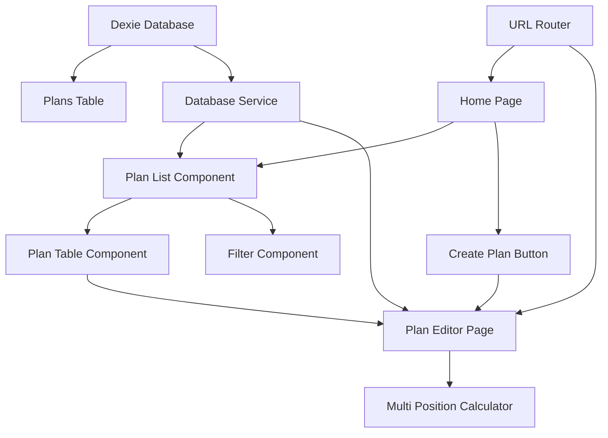

# เอกสารการออกแบบ

## ภาพรวม

ระบบจัดการแผนการเทรดเป็นฟีเจอร์หลักที่จะแทนที่หน้าแรกปัจจุบันของเว็บไซต์ โดยให้ผู้ใช้สามารถจัดการแผนการลงทุนผ่านอินเทอร์เฟซที่ใช้งานง่าย รองรับทั้ง desktop และ mobile พร้อมการจัดเก็บข้อมูลใน IndexedDB ด้วย Dexie.js

## สถาปัตยกรรม

### โครงสร้างระบบ



### การจัดเก็บข้อมูล

ระบบใช้ IndexedDB ผ่าน Dexie.js สำหรับการจัดเก็บข้อมูลในเบราว์เซอร์:

```typescript
// Database Schema
interface TradingPlan {
  id?: number;
  planId: string;        // format: plan_<number>
  name?: string;         // optional
  description?: string;  // optional
  tradingPair: string;   // e.g., "BTCUSDT"
  side: 'long' | 'short'; // ทิศทางการเทรดสำหรับทุก position
  marginMode: 'cross' | 'isolated'; // โหมด margin สำหรับทุก position
  leverage: number;      // leverage สำหรับทุก position ในแผน
  balance: number;       // ยอดเงินที่ใช้ในการเทรด
  unitPreference: 'quantity' | 'orderSize' | 'initialMargin';
  positions: Position[]; // array of position data
  createdAt: Date;
  updatedAt: Date;
}

interface Position {
  size: number;
  entryPrice: number;
}
```

## คอมโพเนนต์และอินเทอร์เฟซ

### 1. Home Page Layout

**ไฟล์:** `app/page.tsx`

หน้าแรกที่แสดงรายการแผนการเทรดและปุ่มสร้างแผนใหม่

**คุณสมบัติหลัก:**
- Header พร้อมชื่อแอปพลิเคชัน
- ปุ่ม "Create New Plan" 
- Plan List Component
- Responsive design สำหรับ mobile และ desktop

### 2. Plan List Component

**ไฟล์:** `components/plan-list.tsx`

คอมโพเนนต์สำหรับแสดงรายการแผนการเทรดในรูปแบบตาราง

**Props:**
```typescript
interface PlanListProps {
  plans: TradingPlan[];
  onPlanSelect: (planId: string) => void;
  onPlanDelete: (planId: string) => void;
}
```

**คุณสมบัติ:**
- ตารางแสดงข้อมูล: Plan ID, Name, Description, Trading Pair, Created Date
- Responsive table สำหรับ mobile (แสดงเป็น card layout)
- Action buttons: Edit, Delete
- Empty state เมื่อไม่มีแผน

### 3. Plan Filter Component

**ไฟล์:** `components/plan-filter.tsx`

คอมโพเนนต์สำหรับกรองแผนตาม trading pair

**Props:**
```typescript
interface PlanFilterProps {
  tradingPairs: string[];
  selectedPair?: string;
  onFilterChange: (pair?: string) => void;
}
```

### 4. Plan Editor Page

**ไฟล์:** `app/plan/[planId]/page.tsx`

หน้าสำหรับสร้างและแก้ไขแผนการเทรด

**URL Structure:**
- สร้างใหม่: `/plan/new`
- แก้ไข: `/plan/plan_1`, `/plan/plan_2`, etc.

**คุณสมบัติ:**
- Form สำหรับกรอกชื่อและคำอธิบายแผน
- Integration กับ Multi Position Calculator
- Save/Cancel buttons
- Auto-save functionality

### 5. Database Service

**ไฟล์:** `lib/database.ts`

Service class สำหรับจัดการ IndexedDB operations

```typescript
class TradingPlanDatabase extends Dexie {
  plans!: Table<TradingPlan, number>;

  constructor() {
    super('TradingPlanDB');
    this.version(1).stores({
      plans: '++id, planId, tradingPair, createdAt, updatedAt'
    });
  }

  async createPlan(planData: Omit<TradingPlan, 'id' | 'planId' | 'createdAt' | 'updatedAt'>): Promise<string>;
  async getPlan(planId: string): Promise<TradingPlan | undefined>;
  async getAllPlans(): Promise<TradingPlan[]>;
  async updatePlan(planId: string, updates: Partial<TradingPlan>): Promise<void>;
  async deletePlan(planId: string): Promise<void>;
  async getFilteredPlans(tradingPair?: string): Promise<TradingPlan[]>;
}
```

## โมเดลข้อมูล

### TradingPlan Schema

```typescript
interface TradingPlan {
  id?: number;              // Auto-increment primary key
  planId: string;           // Unique identifier (plan_1, plan_2, etc.)
  name?: string;            // Optional plan name (max 100 chars)
  description?: string;     // Optional description (max 500 chars)
  tradingPair: string;      // Trading pair (BTCUSDT, ETHUSDT, etc.)
  side: 'long' | 'short';   // ทิศทางการเทรดสำหรับทุก position
  marginMode: 'cross' | 'isolated'; // โหมด margin สำหรับทุก position
  leverage: number;         // Leverage สำหรับทุก position ในแผน
  balance: number;          // ยอดเงินที่ใช้ในการเทรด
  unitPreference: 'quantity' | 'orderSize' | 'initialMargin'; // หน่วยที่ใช้ในการคำนวณ
  positions: Position[];    // Array of position configurations
  createdAt: Date;          // Creation timestamp
  updatedAt: Date;          // Last modification timestamp
}

interface Position {
  size: number;
  entryPrice: number;
  liquidationPrice?: number; // Calculated value
}
```

### Database Indexes

- **Primary Index:** `++id` (auto-increment)
- **Secondary Indexes:** `planId`, `tradingPair`, `createdAt`, `updatedAt`

## การจัดการข้อผิดพลาด

### Database Error Handling

```typescript
class DatabaseErrorHandler {
  static handleDexieError(error: Error): string {
    if (error.name === 'DatabaseClosedError') {
      return 'Database connection lost. Please refresh the page.';
    }
    if (error.name === 'QuotaExceededError') {
      return 'Storage quota exceeded. Please delete some plans.';
    }
    return 'An unexpected error occurred. Please try again.';
  }
}
```

### Error States

1. **Database Unavailable:** แสดงข้อความแจ้งให้ refresh หน้า
2. **Storage Full:** แสดงข้อความแนะนำให้ลบแผนเก่า
3. **Plan Not Found:** Redirect กลับไปหน้าแรกพร้อมข้อความแจ้งเตือน
4. **Network Offline:** แสดงสถานะ offline mode


## การปรับปรุงประสิทธิภาพ

### Database Optimization

1. **Lazy Loading:** โหลดเฉพาะข้อมูลที่จำเป็น
2. **Pagination:** แบ่งหน้าเมื่อมีแผนจำนวนมาก
3. **Caching:** Cache ข้อมูลที่ใช้บ่อย

### UI Optimization

1. **Virtual Scrolling:** สำหรับรายการแผนจำนวนมาก
2. **Debounced Search:** ลดการค้นหาที่ไม่จำเป็น
3. **Optimistic Updates:** อัปเดต UI ทันทีก่อนรอ database

## ความปลอดภัย

### Data Validation

```typescript
const PlanValidationSchema = z.object({
  name: z.string().max(100).optional(),
  description: z.string().max(500).optional(),
  tradingPair: z.string().min(1),
  side: z.enum(['long', 'short']),
  marginMode: z.enum(['cross', 'isolated']),
  leverage: z.number().min(1).max(125),
  balance: z.number().positive(),
  unitPreference: z.enum(['quantity', 'orderSize', 'initialMargin']),
  positions: z.array(PositionSchema).min(1)
});
```

### Input Sanitization

- Sanitize ข้อมูล input ทั้งหมด
- Validate trading pair format
- ป้องกัน XSS attacks

## การย้ายข้อมูล

### Schema Migration Strategy

```typescript
// Version 1 → Version 2 migration example
db.version(2).stores({
  plans: '++id, planId, tradingPair, createdAt, updatedAt, tags'
}).upgrade(tx => {
  return tx.table('plans').toCollection().modify(plan => {
    plan.tags = []; // Add new field with default value
  });
});
```

### Backup and Restore

- Export/Import functionality สำหรับ backup แผน
- JSON format สำหรับ portability